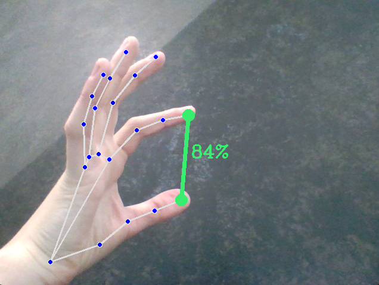

# Computer vision Gesture control

## Работа

После запуска программы появляется окно с видом камеры. На нём камера распознаёт руки и жесты. Все действия кроме последнего выполяются правой рукой. Камера может распознавать обе руки одновременно. Однако, следите, чтобы не было чужих рук в кадре.

## Все жесты

1. **Смахните влево**
   чтобы переключаться между окнами *(аналогично Alt+Tab)*
2. **Смахните вниз**
   чтобы свернуть все окна и отркыть рабочий стол *(аналогично Win+D)*
3. **Сделайте кулак и поверните его горизонтально**
   чтобы заблокировать компьютер *(аналогично Win+L)*
4. **Сделайте кулак и поднимите указательный палец**
   чтобы управлять курсором компьютера, курсор теперь повторяет движения указательного пальца
5. **Коснитесь большим пальцем среднего**
   чтобы сделать клик левой кнопкой мыши
6. **Соедините первые 3 пальца**
   чтобы остановить/продолжить возпроизведение видео или аудио
7. **Скрестите средний и указательный палец**
   чтобы получить сюрприз
8. **Соедините указательный и большой пальцы левой руки**
   чтобы управлять громкостью компьютера, расстояние между указательным и большим пальцем левой руки теперь напрямую коррелирует с громкостью компьюетра. *Чтобы перестать управлять, уберите левую руку из зоны видимости камеры*

## Библиотеки

В проекте используется много разных библиотек. Их полный список и роль в проекте:

* **opencv** - чтение изображения с камеры, работа с ним
* **mediapipe** - распознавание рук
* **pyautogui** - автоматизация компьюетра
* **time** - отмерение задержки между действиями
* **win32api** - пауза медиа
* **ctypesctypes, comtypes, pycaw** - изменение громкости компьютера
* **numpy** - перевод числа из одного отрезка в другой
* **webbrowser** - открывание ссылок в браузере
