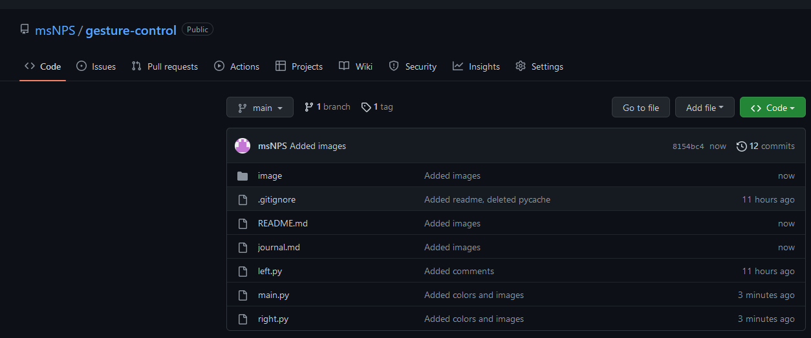
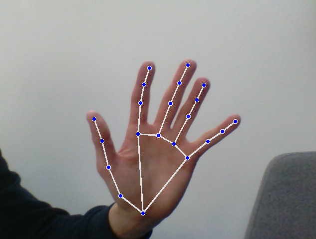
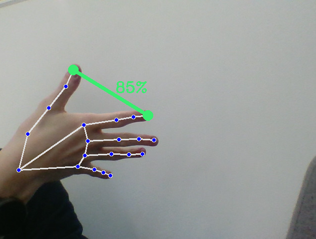
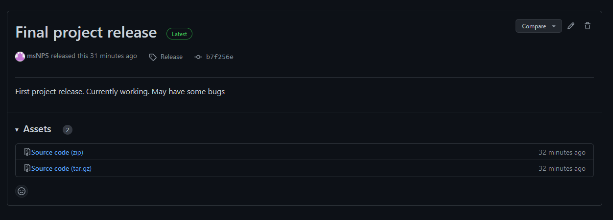

# Журнал проекта

## Подготовка проекта

* Какие библиотеки использовать
* Как будут распознаваться жесты
* Как будет работать автоматизация компьютера
* Создал все нужные файлы
* > Создал проект на Github
  > 

## Выполнение проекта

* Написал код
* Вынес код в разные файлы для левой и правой руки
* Переодически выгружал новые версии в GitHub
* Вёл jorunal.md
  

## Исправление проекта

* Исправлял баги
* Улучшах точность распознавания, добавлением проверок
* Подбирал более точные конфигурации
  

## Анализ проекта

* Описал проект в README.md
* Закончил journal.md
* Сделал релиз на Github
  
